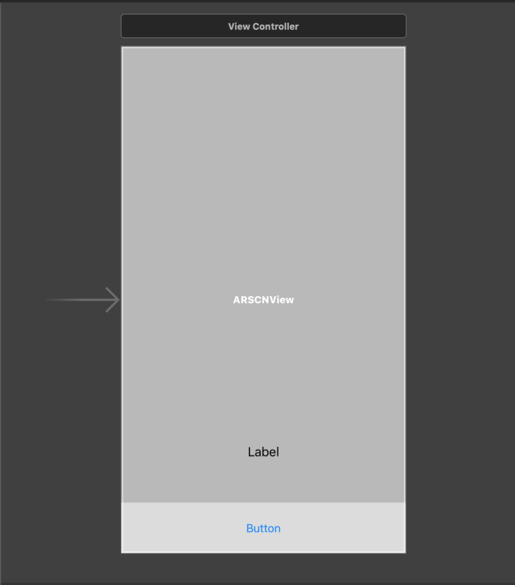
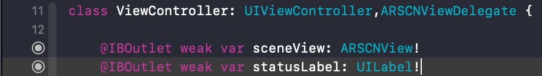
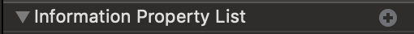
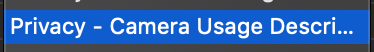
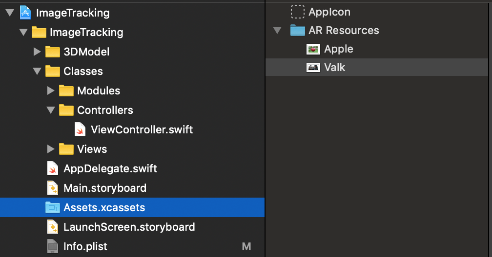
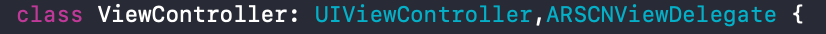

# ImageTracking

## First Tutorial

這是我的第一篇教學文章，寫得不好請多包涵。

這篇要介紹的是ARKit新的World Tracking技術，並加上Image Tracking，能在辨識出指定平面圖像後，將3D物件加入AR世界中。

## ARSession

**ARSession**是**ARKit**中處理所有事物的程序，AR的一切都是從這邊開始。

## AR Axis
在AR的世界中有三度空間，分為**X軸**、**Y軸**、**Z軸**。  
**X軸**代表的是物件在AR世界中**水平**的**左右**位置，正值為右，負值為左。  
**Y軸**代表的是物件在AR世界中**垂直**的**高度**位置，正值為高，負值為低。  
**Z軸**代表的是物件在AR世界中**深度**的**距離**位置，正值為近，負值為遠。  

### 文字很難懂的話來看張圖片吧！  


## Project

讓我們開始寫這次的App吧!  

首先創立一個SigleView專案，並在MainStoryboard加入一個**ARSCNView**。  

---
### ARSCNView


**ARSCNView**是一個將**ARKit**與**SceneKit**整合在一起，並且會自動取用相機，擷取攝像頭所拍攝的畫面，更方便的是裡面已經宣告好ARSession不必另外再做宣告或是調用一些方法。 

---
接著再加入一個**UIButton**，還有一個**UILabel**，配置方式如圖所示。  

  

再來我們將**ARSCNView**,**UILabel**拉IBOutlet進我們的**ViewController**  
像是這樣子  
  

### 光源
在AR世界中，一定要有光源射在物件上，反射後我們才能看出物件的立體感、菱角、陰影等等...。
所以我們這邊使用一個最快速簡單的方式也就是把這兩行程式碼加入viewDidLoad()中。 

``` swift
sceneView.autoenablesDefaultLighting = true
sceneView.automaticallyUpdatesLighting = true
```
### 相機取用  
接著我們必須告訴使用者，App需要使用到相機，詢問使用者是否同意，這個步驟是必須做的，否則App在需要使用到相機的地方就會報錯並且閃退。  

加入的方法如下：首先開到專案中的Info.plist，點擊這個**+**  
  
輸入***Privacy***按鍵盤**方向下鍵**找到這項  
  
接著右方欄位輸入你要跟使用者解釋為什麼要取用相機的原因，我這邊是簡單的輸入  
```
Need to use camera
```
### 重置ARSession
接著我們在App進入後的**viewWillApear()**、**重置按鈕的Acion中**呼叫我們現在要加入在下方的function  

``` swift
func resetTracking() {
        //設定辨識圖集資料夾名稱
        guard let refImages = ARReferenceImage.referenceImages(inGroupNamed: "AR Resources", bundle: nil) else { return }
        
        //設定AR Seesion 配置方式
        let configuration = ARWorldTrackingConfiguration()
        configuration.detectionImages = refImages
        
        //設定ARSCNView Run Option
        let options: ARSession.RunOptions = [.resetTracking, .removeExistingAnchors]
        sceneView.session.run(configuration, options: options)
        
        
        statusLabel.text = "Move camera to your piture"
    }

```
這個function的功能是**初始化**ARSession和成功辨識出某一張圖片時，可以透過按下重置按鈕讓ARSession回到**重新開始辨識圖片的階段**。
### 加入辨識目標圖片
首先我們要在專案裡的**Assets.xcassets**中新增一個AR Resources資料夾，方法在如圖右側空白處點下右鍵，選擇***New AR Resources Group***就會看到圖中的資料夾，資料夾的名稱可以自由命名，但是在上面一步驟的**resetTracking()**中，有個**inGroupNamed**的名稱必須要跟你自己的命名相對應。  

現在要決定想要辨識的圖片，我拿這張蘋果當例子
  
將你要辨識的圖檔直接拉進Xcode中AR Resources資料夾  

***注意：並非拉進Finder中的AR Resources而是直接拉進Xcode介面目錄的AR Resources資料夾***

拉進去後請為你的圖片取一個好名稱，**最好是簡短有力！**我這邊就是直接叫做**Apple**了  
### ARSCNViewDelegate
再來我們要在相機看到我們想要辨識的圖片時做一些事情，那就必須要讓我們的**ViewController**多一項協定，也就是**ARSCNViewDelegate**  

### Renderer
在相機看到任何一張在AR Resources圖片集中的圖片時，會將ARAnchor加入scene中時就會觸發**renderer(_:didAdd:for:)**，所以我們在**ViewController**中加入此function並且編輯裡面的程式碼如下  

``` swift  
func renderer(_ renderer: SCNSceneRenderer, didAdd node: SCNNode, for anchor: ARAnchor) {
		  //將傳入的ARAnchor收下並處理
        guard let imageAnchor = anchor as? ARImageAnchor else { return }
        //辨識到的圖片
        let referenceImage = imageAnchor.referenceImage
        //獲得圖片名稱
        let imageName = referenceImage.name ?? "Error"
        DispatchQueue.main.async{
            self.statusLabel.text = "Image detected: \"\(imageName)\""
        }
}
```

## 完成啦！
現在你的App已經會辨識所有你放在AR Resources中的每一張圖片，並且將他的名字顯示在Label上
##接著我還會在這邊教如何在辨識目標上加入3D物件
敬請期更新謝謝：）